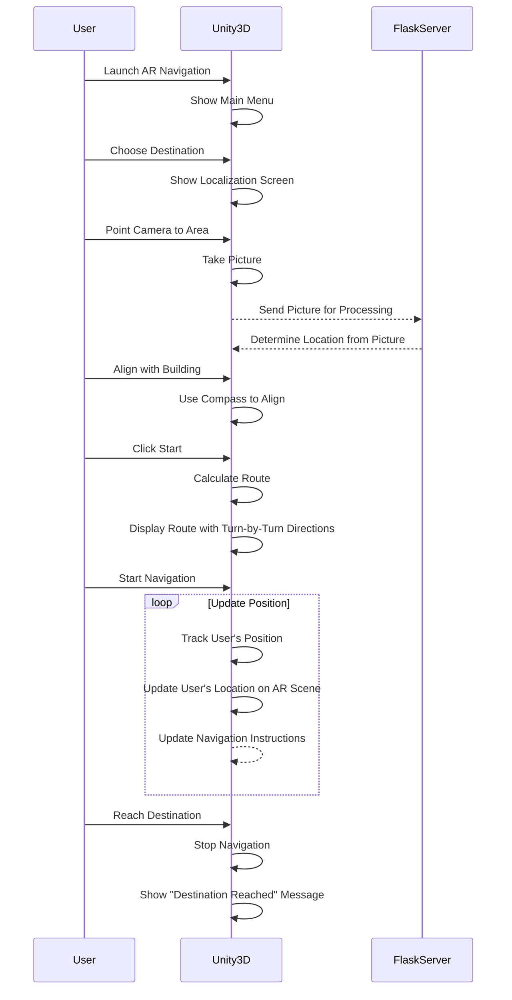

# Wayfinder App

Augmented Reality (AR) application with turn-by-turn navigation of a building.

## Getting started

### Prerequisites

- [Unity 2021.3.x](https://unity3d.com/get-unity/download/archive)

### Using AR Server

To run the localization inference, AR Server need to be running. Learn more on how to setup AR Server here https://github.com/codemaker2015/Wayfinder-App/Server.

### Build and run

1. Go to File > Build Settings and select Android as the platform.
2. Connect Android device to the computer.
3. Click Build and Run.

## Development device

The application is best run on a real physical device, because you can interact with it physically (ie holding, walking, moving around with the camera)

There is a package called [AR Foundation Remote 2.0](https://assetstore.unity.com/packages/tools/utilities/ar-foundation-remote-2-0-201106) that allows debugging AR application
right from the Unity editor. 

### Android Requirements

- Android 7.0 (API Level 24) or later

List of the supported devices by ARCore: https://developers.google.com/ar/devices

## Overall working principle

Sequence diagram below shows the overall working principles of the application.

## References

- [ARCore](https://developers.google.com/ar)
- [Unity ARFoundation](https://developers.google.com/ar/develop/unity-arf/features)
- [ARFoundation Indoor-Navigation Tutorial](https://youtube.com/playlist?list=PLOIYTfRd0Ho7iOI_cnUZxXK6KiCFGhU1s)
